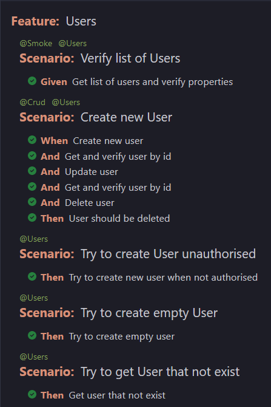

[mid lvl] Intrum QA automation homework solution

Basic tests of https://gorest.co.in//public/v2/users
Tests cover Resources: users, posts, comments, todos as well as nested resources of api.

Test framework:
-Testng and Cucumber -IDE - IntelliJ

Intellij plugins required:
-Gherkin -Cucumber for Java

Run tests:
Execute maven goal using tags:
-mvn test -Dcucumber.tags="@Users"
-mvn test -Dcucumber.tags="@Users and @Smoke" etc. or:
-run tests in Runner classes or:
-run testng.xml

Reporting:
-open in browser cucumber.html files from the target directory -proceed with maven clean before running tests

